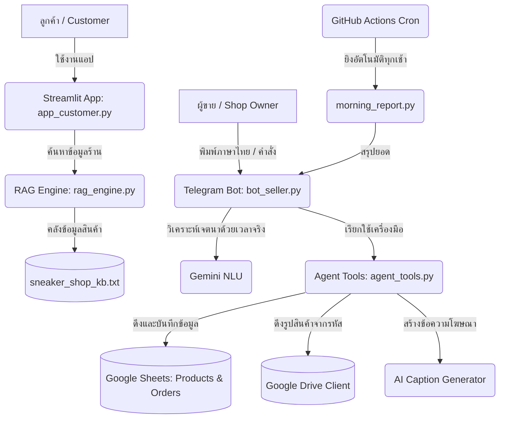

title: Bittle Sneaker
emoji: 👟
colorFrom: indigo
colorTo: blue
sdk: streamlit
sdk_version: "1.57.0"
python_version: "3.11"
app_file: app_customer.py
pinned: false
---

# 👟 Bittle Sneaker — AI Assistant & Telegram Seller Bot

ระบบผู้ช่วยปัญญาประดิษฐ์และระบบจัดการหลังบ้านแบบครบวงจรสำหรับ **Bittle Sneaker** ร้านขายรองเท้ามือสองออนไลน์ 

พัฒนาด้วยความสามารถของ **Streamlit** (ส่วนติดต่อลูกค้า) ร่วมกับ **Gemini 3.1 Flash-Lite** (ผ่าน GenAI SDK ล่าสุด) และแชทบอทฝั่งร้านค้าผ่าน **Telegram Bot API** ระบบมาพร้อมกับการประมวลผลคำสั่งภาษาธรรมชาติแบบครบเครื่องและระบบจัดเก็บข้อมูลบน Google Sheets

> 📖 สามารถอ่านรายละเอียดการออกแบบโปรเจกต์เชิงลึกได้ที่ [PIVOT.md](PIVOT.md)
> 🧪 รายละเอียดการทดสอบระดับระเอียดสามารถศึกษาได้ที่ [docs/TESTING.md](docs/TESTING.md)

---

## 🌐 Live Demo & Chatbot

🔗 **[https://huggingface.co/spaces/atlez/bittle-sneaker](https://huggingface.co/spaces/atlez/bittle-sneaker)**

---

## 💎 Features & Capabilities

ระบบแบ่งการทำงานออกเป็น **2 ฝั่งหลัก** เพื่อสนับสนุนทั้งลูกค้าและการทำธุรกิจของผู้ขาย:

### 1. ฝั่งลูกค้า (Customer UI — Streamlit App)
* **👟 Sandy Chatbot (RAG Engine):** แชทบอทอัจฉริยะตอบคำถามเชิงลึกเกี่ยวกับรองเท้ามือสอง ยี่ห้อ สภาพ ขนาด นโยบายร้านค้า และการรับประกันของแท้โดยใช้กระบวนการ RAG (Retrieval-Augmented Generation) จากฐานความรู้ของร้าน
* **⚡ Quick Actions:** ปุ่มคำสั่งลัดสำหรับคำถามที่ลูกค้าถามบ่อย ช่วยเพิ่มยอดขายและการเข้าถึงข้อมูลได้ไวขึ้น

### 2. ฝั่งผู้ขาย (Seller Platform — Telegram Bot & CLI)
* **🏪 Sandy Seller Bot (`bot_seller.py`):** บอทจัดการหลังบ้านส่วนตัวสำหรับผู้ขาย ทำงานผ่านแชท Telegram โดยจำกัดการใช้งานเฉพาะ `TELEGRAM_CHAT_ID` ของผู้ขายเท่านั้น
* **🧠 Gemini Natural Language NLU:** ผู้ขายสามารถพิมพ์ข้อความภาษาไทยปกติเพื่อสั่งงานบอทได้โดยตรง (เช่น *"บันทึกยอดขาย Nike Dunk Low ไซส์ 42 ราคา 3500 บาท"* หรือ *"ขอยอดกำไรวันนี้"* ) บอทจะใช้ Gemini แปลงความหมายเป็นคำสั่งระบบอย่างเคร่งครัด
* **📦 Check Stock & Filtering:** เช็คสต๊อกสินค้าว่างอย่างรวดเร็ว พร้อมฟิลเตอร์แบรนด์ รุ่น และไซส์ได้ทันที (เช่น `/stock nike` หรือ `/stock dunk low 42`)
* **📊 Sales & Profit Summary:** แสดงรายงานสรุปยอดขายและ**ยอดกำไร (Profit)** รวม ทั้งแบบรายวัน, รายเดือน, รายปี หรือระบุวันที่เจาะจงผ่านประวัติย้อนหลัง เช่น ยอดขายเมื่อวานนี้
* **📸 Product Image Viewer:** แสดงรูปภาพจริงของรองเท้าที่มีรหัสสินค้าจาก Google Drive ส่งตรงเข้าห้องแชท Telegram ทันที
* **✨ AI Caption Generator:** สร้างสรรค์แคปชั่นสำหรับลงโซเชียลมีเดียโปรโมตรองเท้าคู่ใหม่ได้ทันใจถึง 3 สไตล์ยอดนิยม (Cute, Minimal, Gen-Z)
* **🌅 Morning Report:** รายงานสรุปสถานะยอดขายและกำไรของวันก่อนหน้าส่งเข้า Telegram ของเจ้าของร้านแบบอัตโนมัติทุกเช้า

---

## 🏗️ System Architecture



---

## 📂 Project Structure

```text
.
├── bot_seller.py                # บอทคู่ใจผู้ขายหลักบน Telegram (บันทึกขาย, เช็คสต๊อก, ดูรูป, สรุปกำไร)
├── app_customer.py              # แอป Streamlit ฝั่งลูกค้า
├── features/
│   ├── agent_harness.py          # ตัวควบคุมประสานงานคำสั่งและโมเดล Gemini
│   ├── agent_tools.py            # ชุดเครื่องมือระบบ (log_sale, get_sales_today, get_sales_summary, get_sales_by_date, check_stock)
│   ├── rag_engine.py             # เครื่องมือ RAG ค้นหาบริบท (TF-IDF based)
│   ├── morning_report.py         # คิวงานสรุปยอดขายส่ง Telegram ทุกเช้า
│   ├── sales_logger.py           # CLI ยอดฮิตสำหรับบันทึกรายการขายแบบรวดเร็ว
│   ├── sheets_client.py          # ตัวเชื่อมต่อ API Google Sheets 
│   └── caption_gen.py            # ตัวเขียนแคปชั่น AI ด้วย Gemini
├── knowledge/
│   └── sneaker_shop_kb.txt       # คลังความรู้และรายการรองเท้ามือสองของร้าน
├── docs/
│   └── TESTING.md                # คู่มือและรายละเอียดการทำ Unit Tests
├── tests/                        # ชุดทดสอบและจำลองระบบ (Unit & Integration Tests)
├── .github/workflows/
│   ├── deploy.yml                # สั่งการ Build และอัปเดตแอปอัตโนมัติไปยัง Hugging Face Spaces
│   ├── morning_report.yml        # สั่งการส่งรายงานทุกเช้าผ่าน Cron Job
│   └── seller_bot.yml            # รันบอทหลังบ้านผู้ขายทิ้งไว้บนระบบ GitHub Actions
├── PIVOT.md                      # บันทึกแนวคิดและการออกแบบระบบ
└── requirements.txt              # รายการ Library dependencies
```

---

## 🚀 Local Installation & Configuration

### 1. โคลนโปรเจกต์และสร้าง Virtual Environment
```bash
git clone https://github.com/atlezero/milk-on-the-beach.git
cd milk-on-the-beach
python -m venv .venv
```

### 2. เปิดใช้งาน Environment
* **Windows (PowerShell):**
  ```powershell
  .\.venv\Scripts\Activate.ps1
  ```
* **Windows (CMD):**
  ```cmd
  .venv\Scripts\activate.bat
  ```
* **macOS / Linux:**
  ```bash
  source .venv/bin/activate
  ```

### 3. ติดตั้ง Dependencies ทั้งหมด
```bash
pip install -r requirements.txt
```

### 4. กำหนดค่า Environment Variables (.env)
สร้างไฟล์ชื่อ `.env` ไว้ที่โฟลเดอร์หลักของโปรเจกต์ (Root) และกรอกข้อมูลต่อไปนี้:

```env
# Gemini API Key
GEMINI_API_KEY=AIzaSy...

# Google Sheets Configuration
GOOGLE_SHEETS_ID=1x2y3z...
GOOGLE_SERVICE_ACCOUNT_FILE=./service-account.json

# Telegram Configuration
TELEGRAM_BOT_TOKEN=123456789:ABCDefGh...
TELEGRAM_CHAT_ID=987654321

# Google Drive API Configuration (สำหรับการดึงรูปภาพสินค้า)
GOOGLE_DRIVE_FOLDER_ID=folder-id-on-drive
```

---

## 🎮 Execution Guide

### 📱 การรันแอป Streamlit ฝั่งลูกค้า
```bash
streamlit run app_customer.py
```
เปิดบราวเซอร์ไปที่ `http://localhost:8501` เพื่อจำลองการสนทนาของฝั่งลูกค้า

### 🏪 การรันบอท Telegram ฝั่งร้านค้า (Seller Bot)
```bash
python bot_seller.py
```
เมื่อรันแล้ว สามารถทดลองเข้าแอป Telegram ไปยังช่องแชทบอทของคุณแล้วเริ่มคุยได้ทันที:
* **พิมพ์ภาษาไทยเพื่อสั่งการหลังบ้าน:**
  * *"เช็คสต๊อก Nike หน่อย"*
  * *"ขาย Adidas Samba ไซส์ 41 ราคา 2900 โอนเงิน ขายบน IG ลูกค้าชื่อจอย"* (บอทจะบันทึกลงชีทโดยตรง)
  * *"สรุปยอดขายเมื่อวานนี้"* (บอทจะประเมินเวลาปัจจุบันแล้วคำนวณยอดขาย/กำไรส่งกลับทันที)
* **พิมพ์คำสั่งระบบตรง ๆ (Commands):**
  * `/stock` — เช็คสต๊อกสินค้าที่พร้อมขายทั้งหมด
  * `/sales month` — สรุปยอดขายและยอดกำไรของเดือนนี้
  * `/photo NK-001` — ค้นหาและดูรูปถ่ายจริงของรองเท้ารหัส NK-001

---

## 🧪 Testing

เราให้ความสำคัญกับเสถียรภาพของระบบผ่านกระบวนการทำ Unit Test และ Integration Test:

```bash
# รันการทดสอบทั้งหมดของระบบ
pytest
```
*ศึกษารายละเอียดของชุดทดสอบและสถิติ Coverage เพิ่มเติมได้ที่ [docs/TESTING.md](docs/TESTING.md)*

---

## ⏰ Timezone & Locale
เพื่อความโปร่งใสในข้อมูลและการทำงานแบบอัตโนมัติ:
* วันเวลาที่ถูกบันทึกลงประวัติการขาย, รายงานสรุปเช้า, และการคำนวณสรุปผลตามวัน จะถูกกำหนดให้อิงตามเวลาท้องถิ่นประเทศไทย **`UTC+7 (Asia/Bangkok)`** เสมอ

## 🔒 Security Best Practices
* **ไฟล์ห้าม commit ขึ้น GitHub:** ไฟล์สำคัญ เช่น `.env`, `service-account.json`, logs ทุกตระกูล (`*.log`), และโฟลเดอร์ `.venv/` ได้รับการป้องกันผ่าน `.gitignore` เพื่อความปลอดภัยของข้อมูลลูกค้าและเจ้าของร้าน